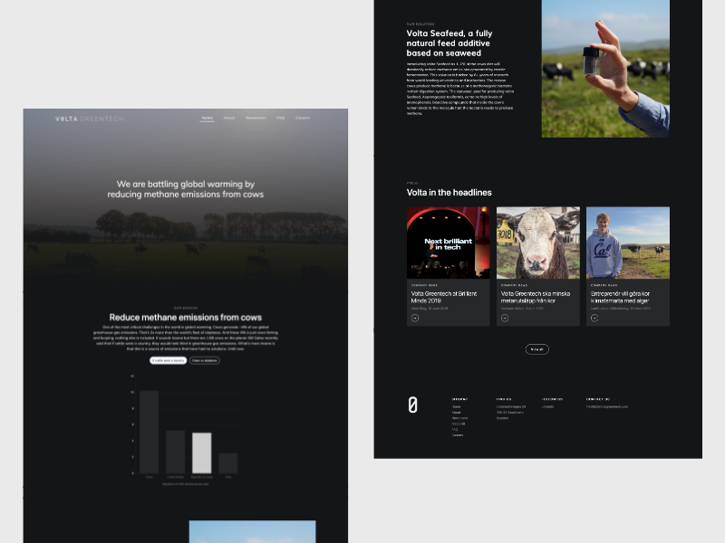

# Website for Volta Greentech
I built a website for Volta, a startup battling global warming by reducing methane emissions from cows. Used html, css, javascript, jquery, bootstrap and chart.js.  
You can see the website live over at www.voltagreentech.com

